# 🗺️ DevStack Agency — Visual Architecture Guide

> **What this document is:** A visual companion to `PLAN.md`. If PLAN.md is the detailed blueprint, this is the poster on the wall. Read this first, then dive into PLAN.md sections for details.

---

## 1. The Problem We're Solving

### The Gap

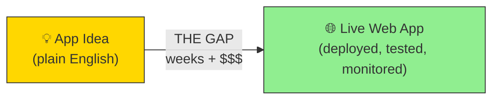

**Today, crossing this gap requires:**

| Path | Cost | Time | Quality |
|------|------|------|---------|
| Hire a freelancer | $5,000–15,000 | 2–4 weeks | Variable (often no tests, no monitoring) |
| Hire a dev agency | $20,000–80,000 | 6–12 weeks | High but expensive |
| Build it yourself | Free (but your time) | 2–3 days just for boilerplate | Depends on your skill |
| Bolt.new / Lovable | $0–20 | 10 minutes | Prototype only — no auth, no DB, no deploy |

**Our solution:** An autonomous AI agency that crosses the gap in **~3 hours for under $25** — with tests, security, monitoring, and audit trail included.

---

## 2. System Overview — The 5-Agent Pipeline

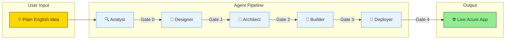

### What Each Agent Does (and Why It Exists)

| Agent | What it does | Why it's separate | What it produces |
|-------|-------------|-------------------|-----------------|
| **🔍 Analyst** | Asks clarifying questions, locks scope | Prevents "build the wrong thing" — cheapest place to catch misunderstandings ($0 at Gate 0) | `intake.json` — structured requirements |
| **🎨 Designer** | Generates mockups, flow diagrams | Sam sees the app before any code — easy to change direction here vs after 500 lines of code | `DESIGN.md`, SVG flows, HTML mockups |
| **📐 Architect** | Designs database, APIs, auth model | Separates "what to build" from "how to structure it" — catches data model mistakes before code | `DATA_MODEL.md`, `API_CONTRACTS.md`, `AUTH_PLAN.md` |
| **🔨 Builder** | Writes tests first, then code | TDD is mandatory — the Builder can't skip tests. Catches bugs before deployment. | Tested code, GitHub PR, red/green test logs |
| **🚀 Deployer** | Provisions Azure infra, deploys app | Infrastructure-as-code ensures repeatability. Same Terraform for every project. | Live staging URL, Terraform state |

---

## 3. The 5 Human Gates — Why Humans Stay in the Loop

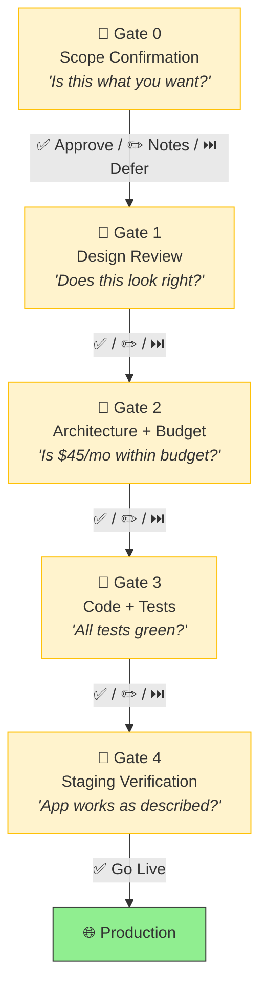

**Why gates, not full automation?**
- "Human = board of directors" (Harper Reed principle). Agents propose, humans approve.
- Gates 0, 1, 4 are intuitive for anyone (look at mockups, check if app works).
- Gates 2-3 have plain-language guides — Sam checks budget and test results, not code.
- Each gate is a cheap undo point. Catching a mistake at Gate 0 costs $0. Catching it after deploy costs $20+.

**Gate actions:**
- **✅ Approve** — pipeline continues
- **✏️ Give Notes** — agent re-runs the stage with feedback
- **⏭️ Defer** — "Accept for now, address later" — pipeline continues, deferred items shown at Gate 4
- **24h timeout** — if no action taken, pipeline pauses (not fails). Resume anytime from AMC.

---

## 4. Architecture — Hexagonal / Ports & Adapters

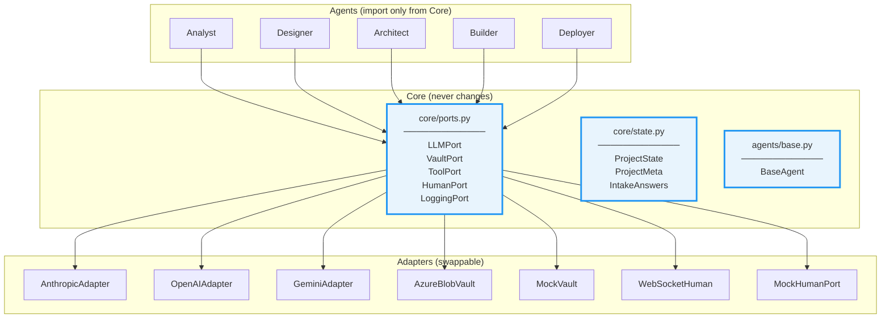

**Why hexagonal?**
- **Agents never know which LLM they're using.** Swap Claude for GPT-4o by changing one YAML line — zero agent code changes.
- **Testing is trivial.** Plug in MockVault + MockHumanPort + MockLLM → full integration test with no Azure account.
- **Enforced by CI:** `import-linter` blocks any PR where `agents/` imports from `adapters/`. The architecture rule can't be accidentally broken.

**Why it matters for this project specifically:**
LLM providers change pricing, add features, and break APIs constantly. With hexagonal architecture, we absorb all of that in the adapter layer. The agents — the expensive, prompt-engineered part — stay stable.

---

## 5. Data Flow — How State Moves Through the Pipeline

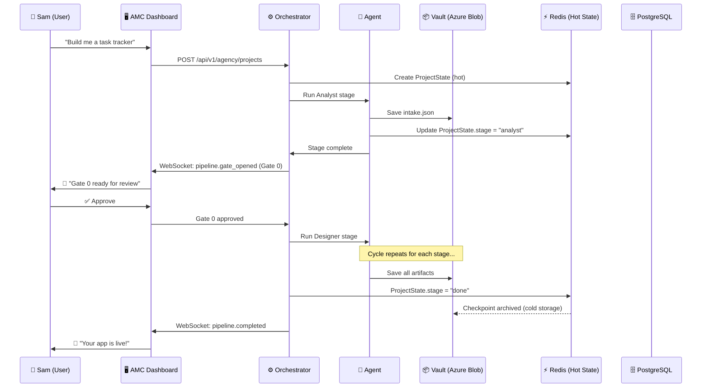

**Two memory layers (and why):**
- **Redis (hot):** Current pipeline state. Fast reads for real-time AMC updates. 24h TTL for active projects, 30-day TTL for checkpoints. If Redis dies, pipeline pauses but no data is lost (Vault has everything).
- **Azure Blob (cold):** All artifacts (code, designs, configs). Permanent. The "vault" that every agent writes to and reads from. One container per project. SAS URLs for binary assets (SVGs, mockups).

**Why not just a database?**
PostgreSQL stores user/project metadata and LLM call logs (structured, queryable). Redis stores hot pipeline state (fast, ephemeral). Blob stores artifacts (large, binary). Each storage layer does what it's best at.

---

## 6. Security Architecture

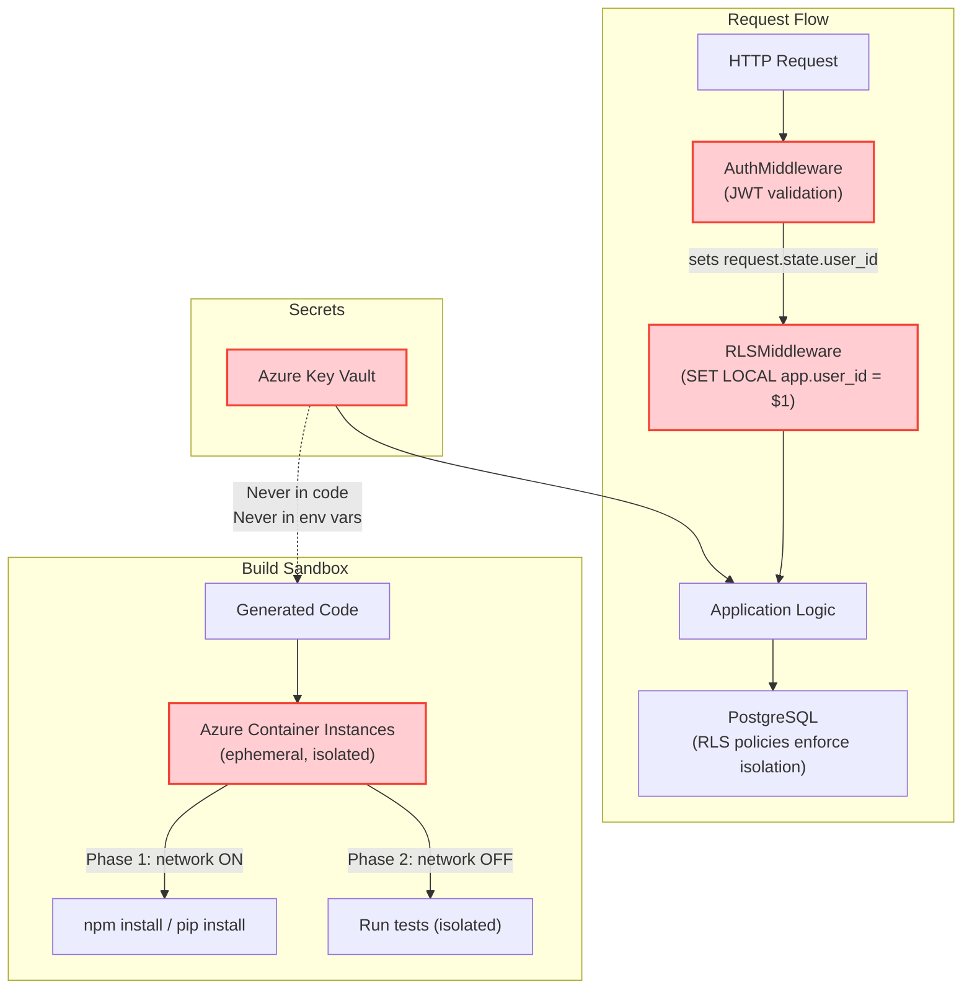

**Key security decisions and why:**

| Decision | Why | What breaks if violated |
|----------|-----|------------------------|
| **Auth before RLS** in middleware stack | JWT must be validated before we trust the user_id for RLS | Attacker forges user_id → sees all data |
| **Parameterized `$1` queries** for SET LOCAL | f-strings allow SQL injection into the RLS context | Attacker injects `'; DROP TABLE users; --` |
| **PgBouncer session mode** | Transaction mode resets SET LOCAL on connection return | Silent RLS bypass → data leak between users |
| **ACI not ACA** for sandbox | ACA doesn't support Docker-in-Docker | Can't isolate generated code execution |
| **Network off in test phase** | Prevents generated code from phoning home | Exfiltration of secrets or user data |

---

## 7. Tech Stack — What and Why

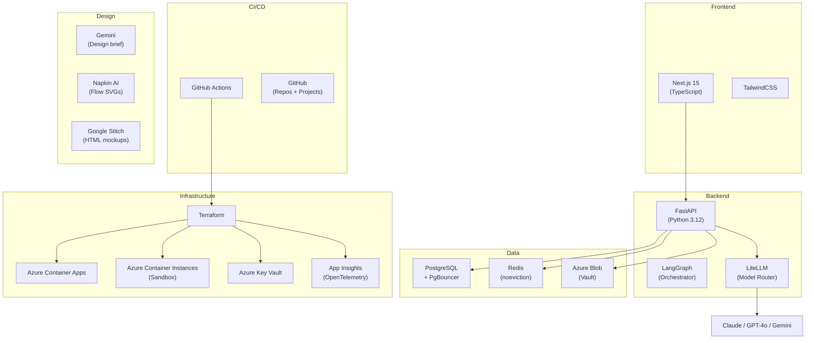

**Why this stack is fixed (and why that's a feature, not a limitation):**

The #1 cause of AI hallucination in code generation is **framework choice ambiguity**. "Should I use React or Vue? Express or FastAPI? AWS or Azure?" Each decision doubles the prompt complexity and halves the code quality.

By fixing the stack, we:
1. **Eliminate decision hallucination** — the agent never wastes tokens choosing between frameworks
2. **Maximize prompt quality** — every skill file is optimized for exactly this stack
3. **Enable compound learning** — each project improves the skills for the SAME stack, so quality compounds

**Why THESE specific technologies:**

| Choice | Why this one |
|--------|-------------|
| **Next.js** | Most popular React framework. Largest skill training corpus. Server components reduce client complexity. |
| **FastAPI** | Async Python + automatic OpenAPI docs + Pydantic validation. The generated API is self-documenting. |
| **PostgreSQL** | RLS support (critical for multi-tenancy). The most battle-tested open-source DB. |
| **Azure** | ACI for ephemeral sandboxes (unique capability). Enterprise-friendly. Key Vault for secrets. |
| **Terraform** | Declarative, repeatable, auditable. The agent can generate and validate infra configs deterministically. |

---

## 8. Anti-Hallucination Contract — The 4 Rules

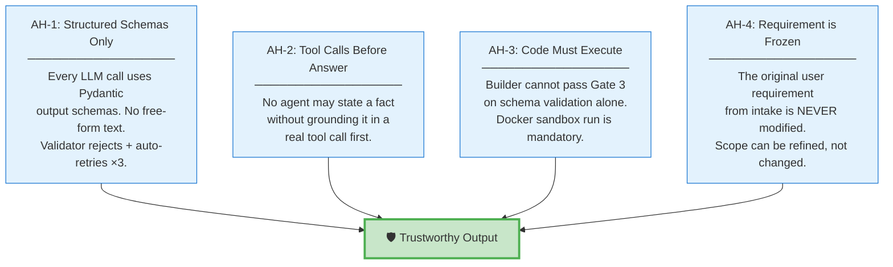

**Why these specific rules?**
- **AH-1** prevents the most common AI failure: unstructured output that drifts from spec. Pydantic schemas reject invalid output and auto-retry with error feedback.
- **AH-2** creates an audit trail — every claim is grounded in a tool call (`web_search`, `read_file`, `run_tests`), never fabricated from training data.
- **AH-3** prevents "it looks right" code that actually crashes at runtime — the Docker sandbox catches this. TDD forces tests written first (red phase) before implementation (green phase).
- **AH-4** prevents scope creep — the single biggest risk in any software project. The `original_requirement` field is `frozen=True` in Pydantic and never summarized away.

---

## 9. Cost Flow — Where Money Goes

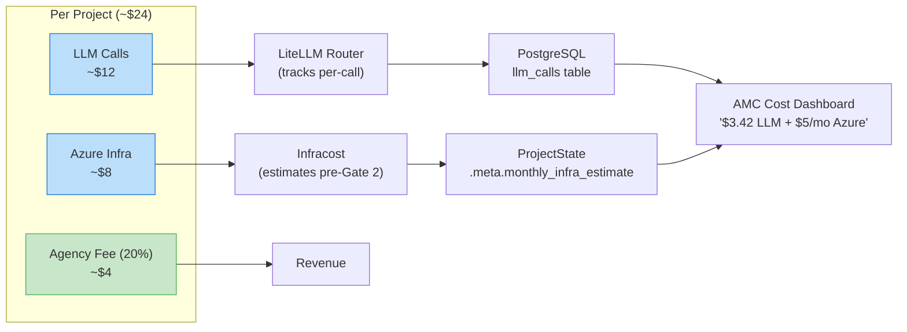

**Cost controls (why each exists):**

| Control | Why |
|---------|-----|
| **Token budget per project** | Prevents runaway LLM costs from a single complex project |
| **Circuit breaker (3 failures)** | If an LLM is misbehaving, stop spending money and switch to fallback |
| **Infracost before Gate 2** | Sam sees the Azure bill BEFORE infrastructure is provisioned — can change scope |
| **LiteLLM per-call logging** | Every cent is tracked. No surprise bills. Full cost audit trail. |
| **Hard USD budget cap** | User sets max spend at intake. Pipeline halts (not silently overruns) if exceeded. |

---

## 10. SDLC — Full Software Development Lifecycle

```mermaid
graph TB
    subgraph "Phase 1: Requirements"
        I1["User describes idea"] --> I2["Analyst asks clarifying questions"]
        I2 --> I3["IntakeAnswers validated"]
        I3 --> G0["🚦 Gate 0: Scope Lock"]
    end
    
    subgraph "Phase 2: Design"
        G0 --> D1["Gemini generates design brief"]
        D1 --> D2["Napkin AI creates flow SVGs"]
        D2 --> D3["Stitch creates HTML mockups"]
        D3 --> G1["🚦 Gate 1: Design Review"]
    end
    
    subgraph "Phase 3: Architecture"
        G1 --> A1["Data model design"]
        A1 --> A2["API contracts"]
        A2 --> A3["Auth plan + Infracost estimate"]
        A3 --> G2["🚦 Gate 2: Architecture + Budget"]
    end
    
    subgraph "Phase 4: Build & Test"
        G2 --> B1["🔴 Write failing tests (RED)"]
        B1 --> B2["🟢 Write code to pass (GREEN)"]
        B2 --> B3["Run in ACI sandbox"]
        B3 --> B4["OWASP security check"]
        B4 --> B5["Open GitHub PR"]
        B5 --> G3["🚦 Gate 3: Code + Tests"]
    end
    
    subgraph "Phase 5: Deploy"
        G3 --> E1["Terraform plan"]
        E1 --> E2["Terraform apply"]
        E2 --> E3["Deploy to ACA"]
        E3 --> E4["Inject OpenTelemetry"]
        E4 --> E5["Staging URL ready"]
        E5 --> G4["🚦 Gate 4: Staging Verify"]
    end
    
    subgraph "Phase 6: Live"
        G4 --> L1["🌐 Production deploy"]
        L1 --> L2["Monitoring active"]
        L2 --> L3["Audit trail complete"]
    end
```

---

## 11. Agency Management Console (AMC) — The Control Plane

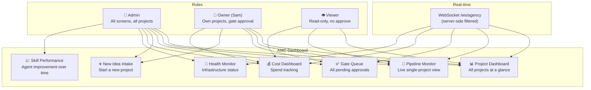

**Why the AMC exists:**
When you're running multiple projects, you need one place to see everything — which projects are running, which gates need approval, how much you're spending. Without the AMC, you'd be checking email, GitHub, and Azure Portal separately. The AMC replaces all of that with a single dashboard.

---

## 12. How Everything Connects — Full System Map

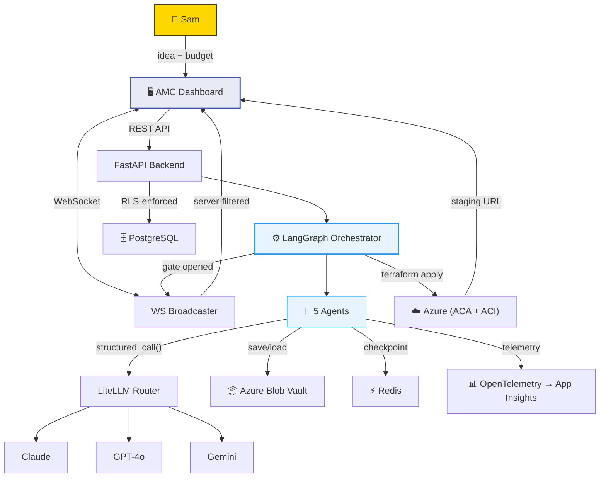

---

## 13. Building DevStack — Harness Engineering Approach

> **Source:** OpenAI "Harness Engineering" (2026) + [Squad](https://github.com/bradygaster/squad) framework patterns.

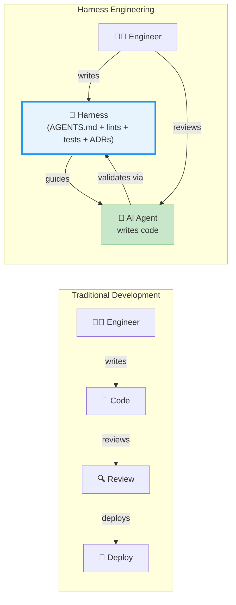

**What makes our repo agent-legible:**

| Layer | File | Purpose |
|-------|------|---------|
| **Entry point** | `AGENTS.md` | ~80 lines — first thing any AI agent reads |
| **Commands** | `Makefile` | `make setup`, `test`, `lint`, `dev`, `ci` |
| **Architecture** | `docs/architecture.md` | Codebase map + dependency rules |
| **Decisions** | `docs/decisions/` | ADR files — why we chose what |
| **Guardrails** | Lint rules + CI | Mechanical enforcement of architecture |
| **Deep specs** | `PLAN.md` | Full detail (referenced from AGENTS.md) |

**Progressive disclosure:** AGENTS.md → docs/ → PLAN.md (shallow → deep). AI agents start at AGENTS.md and follow links only when they need deeper context. This prevents overwhelming agent context windows with 125KB of spec.

**Knowledge compounds:** Every lint rule, skill file, or ADR a developer adds makes every AI agent on the team better. A frontend expert encodes React patterns → everyone's agents produce better React. A security expert encodes OWASP rules → everyone's agents produce safer code.

> Full spec: PLAN.md §22

---

## Quick Reference — Section Map to PLAN.md

| This section | Explains | PLAN.md detail |
|---|---|---|
| §1 Problem | Why this exists | §0 Product North Star |
| §2 Pipeline | The 5 agents | §2 Agent Roster |
| §3 Gates | Human approval design | §7 HITL Design |
| §4 Architecture | Hexagonal / ports | §1c Clean Architecture |
| §5 Data flow | State + memory | §5 Memory, §8 BaseAgent |
| §6 Security | Auth, RLS, sandbox | §6 Tech Stack |
| §7 Tech stack | What and why | §6 Tech Stack |
| §8 AH rules | Anti-hallucination | §1b AH Contract |
| §9 Cost flow | Cost tracking | §9 Cost Controls, §19 Business |
| §10 SDLC | Full lifecycle | §4 Core Loop, §10 Build Phases |
| §11 AMC | Dashboard overview | §21 AMC |
| §12 System map | Everything connected | Whole document |
| §13 Harness engineering | How we build with AI agents | §22 Harness Engineering |

---

*This document uses [Mermaid](https://mermaid.js.org/) diagrams. View in any Mermaid-compatible renderer (GitHub, VS Code with Mermaid extension, Obsidian, etc.).*
